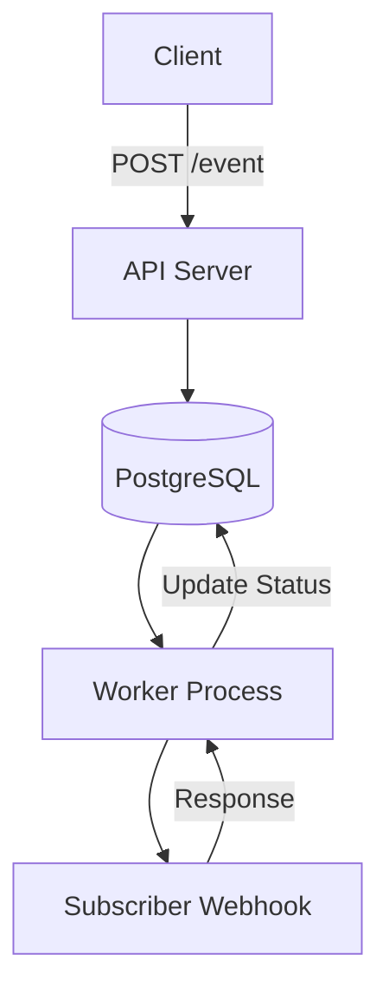

# Webhook Dispatcher

A reliable, production-ready webhook delivery system that handles retries, strict ordering, and failure recovery gracefully.

## 📌 Overview

This system receives events from your application and delivers them to registered subscribers via HTTP webhooks. It is designed to handle the "unreliable nature" of the internet by implementing intelligent retry logic, delivery tracking, and concurrency-safe processing.

## ✨ Features

- **Exponential Backoff Retries**: Prevents overwhelming failing servers (10s → 30s → 2min → 10min → 1hr).
- **Dead-Letter Handling**: Automatically marks deliveries as `dead` after max retries to prevent infinite loops.
- **Ordering Guarantees**: Uses `sequence_id` to ensure events for a specific subscriber are processed in the exact order they were created.
- **Manual Replay**: Ability to re-trigger a failed or dead delivery via API without mutating the original record.
- **Audit Trail**: Every single single attempt (success or failure) is logged with latency and HTTP status.
- **Security**: HMAC-SHA256 signature signing to allow subscribers to verify that the request came from this system.
- **Concurrency Safe**: Uses `FOR UPDATE SKIP LOCKED` to allow multiple worker instances to run in parallel without processing the same delivery twice.

## 🏗️ Architecture


 ## Database Schema

### Main Tables

- **`subscribers`** — Stores webhook endpoints, secrets, and subscription preferences.
- **`events`** — Stores the original event payload and global metadata.
- **`deliveries`** — Tracks the state of a specific event for a specific subscriber.
- **`delivery_attempts`** — A detailed log of every HTTP request made (success or failure).

### Key Columns in `deliveries`

| Column            | Description                                              |
|-------------------|----------------------------------------------------------|
| `status`          | `pending`, `processing`, `success`, or `dead`            |
| `attempt_count`   | Number of times this delivery has been attempted         |
| `next_retry_at`   | Timestamp when the worker should retry                   |
| `locked_at`       | Used to detect and recover stuck/crashed workers         |
| `sequence_id`     | Used to maintain strict ordering per subscriber          |

## How It Works

1. **Event Trigger**: When an event is posted to `/event`, the system identifies all matching active subscribers and creates a `pending` delivery record for each.

2. **Worker Polling**: The worker continuously looks for deliveries where `status = 'pending'` and `next_retry_at <= NOW()`.

3. **Locking**: It uses `FOR UPDATE SKIP LOCKED` to safely claim a delivery so no other worker can process the same record.

4. **Delivery**: The worker sends an HTTP POST request to the subscriber's webhook URL.

5. **Outcome**:
   - **Success** (HTTP 2xx) → Delivery marked as `success`
   - **Failure** (non-2xx, timeout, etc.) → Scheduled for retry based on the backoff schedule
   - **Max Retries Reached** → Delivery marked as `dead`

### Retry Schedule

| Attempt       | Delay         |
|---------------|---------------|
| 1st Failure   | 10 seconds    |
| 2nd Failure   | 30 seconds    |
| 3rd Failure   | 2 minutes     |
| 4th Failure   | 10 minutes    |
| 5th Failure   | 1 hour        |

After the 5th failure, the delivery is marked as `dead`.

## Replay Feature

If a delivery fails repeatedly (e.g., subscriber's server is down for a long time), you can manually replay it:

```http
POST /replay/:delivery_id
```
This creates a fresh delivery record with attempt_count = 0, ensuring the original failure history is preserved for auditing while allowing the event to be delivered.

## Security (HMAC Signature)

To prevent spoofing, the system signs the webhook payload using the subscriber’s secret. The signature is sent in the `X-Webhook-Signature` header.

### Verification Example (Node.js)

```js
const crypto = require("crypto");

function verifySignature(payload, signature, secret) {
  const expected = crypto
    .createHmac("sha256", secret)
    .update(JSON.stringify(payload))
    .digest("hex");

  return signature === `sha256=${expected}`;
}
```
## 📡 API Endpoints

| Method | Endpoint | Description |
| :--- | :--- | :--- |
| `POST` | `/subscribe` | Register a new webhook subscriber |
| `POST` | `/event` | Trigger an event to all matching subscribers |
| `GET` | `/deliveries` | View delivery history (supports filters & pagination) |
| `POST` | `/replay/:delivery_id` | Replay a failed or dead delivery |

## 🚀 Running the Application

### 1. Start the API Server
```bash
node app.js
```
### 2. Start the Worker
```bash
node worker.js
```
Note: You can run multiple worker processes across different terminals or servers to increase throughput.

## ⚖️ Trade-offs & Future Improvements

- **Polling vs Queues**: Currently uses database polling for simplicity. For higher scale, this can be migrated to Redis + BullMQ or Kafka.
- **Rate Limiting**: Future versions can add per-subscriber rate limits to protect small endpoints.
- **Distributed Locking**: Currently relies on PostgreSQL locks. Can be enhanced with Redlock for multi-instance or multi-region deployments.
